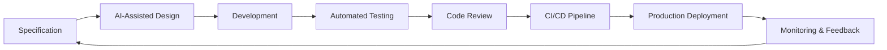

# Data Analysis
Technical Skills: Excel, Python, SQL, Data Modeling, Microsoft Azure, Tableau, Power BI, Microservice, Project Management, AI Engineer


## Link Social Media
<!-- LinkedIn -->
<a href="https://www.linkedin.com/in/burhanudin-badiuzaman4a9204161/" target="_blank">
  
</a>
&nbsp;
<!-- GitHub -->
<a href="https://github.com/burhanudinera2018" target="_blank">
  
</a>
&nbsp;
<!-- Coursera -->
<a href="https://www.coursera.org/learner/burhanudin-badiuzaman-1477" target="_blank">
  
</a>


### Education
- Electrical Engineer - Information Technology, MSc
- Electrical Engineer - Telecommunication, S.T

### Work Experience

#### Data Science - Freelance
- Data Analytics Virtual Intership Project 1!
- Power BI Virtual Intership Project 2!
- Data Analytics and Virtualization Virtual Intership Project 3!
- Commonwealth Bank Introduction to Data Science Job Simulation Virtual Intership Project 4!
- BCG Data Science Job Simulation on Forage Job Simulation Virtual Intership Project 5!
- Tata Data Visualisation: Empowering Business with Effective Insights Job
Simulation Virtual Intership Project 6!
- Develop a chatbot to assist with financial inquiries with the GenAI team at BCG Simulation Virtual Intership Project 7!
  
#### Architecture System @ PUSINTEK - Kementrian Keuangan Republik Indonesia
- Reengineering Application IT System PUSINTEK

#### Indosat Group ( PT Indosat Tbk)
- Internet Dedicated Network Service (PT Indonesia Power)
- Internet Dedicated Network Service and Internet of Things Project (PT INKA Persero)
- Internet Dedicated Netork Service and Internet of Things Project (PT Phapros Tbk)
- Internet Dedicated Network Service and Smart Building (HK Realtindo)
- Head Account mobile service (Bank Mandiri Tbk)
- Head Account mobile ervice (Bank BNI Tbk)
- Head Account mobile service (PO Rosalia Indah)
- B2B Indosat Head Account
  

---
### Project
---
**1. Quantium Data Analytics Job Simulation on Forage - September 2024**
 * Completed a job simulation focused on Data Analytics and Commercial Insights
   for the data science team.
 * Developed expertise in data preparation and customer analytics, utilizing
   transaction datasets to extract valuable insights and deliver data-driven
   commercial recommendations.
 * Extended analytical capabilities to identify benchmark stores for conducting
   uplift testing on trial store layouts, enabling evidence-based
   decision-making.
 * Leveraged acquired data analytics and insights from previous tasks to create
   comprehensive reports for the Category Manager, facilitating informed
   strategic decisions and enhancing commercial applications.

    

---
---

**2. PwC Switzerland Power BI Job Simulation on Forage - September 2024**


 * Completed a job simulation where I strengthened my PowerBI skills to better
   understand clients and their data visualisation needs.
 * Demonstrated expertise in data visualization through the creation of Power BI
   dashboards that effectively conveyed KPIs, showcasing the ability to respond
   to client requests with well-designed solutions.
 * Strong communication skills reflected in the concise and informative email
   communication with engagement partners, delivering valuable insights and
   actionable suggestions based on data analysis.
 * Leveraged analytical problem-solving skills to examine HR data, particularly
   focusing on gender-related KPIs, and identified root causes for gender
   balance issues at the executive management level, highlighting a commitment
   to data-driven decision-making.


 
---
---

**3. Accenture North America Data Analytics and Visualization Job Simulation on
Forage - September 2024**


 * Completed a simulation focused on advising a hypothetical social media client
   as a Data Analyst at Accenture
 * Cleaned, modelled and analyzed 7 datasets to uncover insights into content
   trends to inform strategic decisions
 * Prepared a PowerPoint deck and video presentation to communicate key insights
   for the client and internal stakeholders
    
   

---
---
**4. Commonwealth Bank Introduction to Data Science Job Simulation on Forage -
October 2024**


 * Completed a job simulation involving Data Management skills for Commonwealth
   Bank's Data Science team.
 * Demonstrated proficiency in creating data engineering pipelines to aggregate
   and extract valuable insights from datasets, optimizing data-driven
   decision-making.
 * Acquired skills in anonymizing personal data within datasets, ensuring
   compliance with data privacy regulations.
 * Proposed effective data analysis approaches, particularly related to social
   media, and demonstrated the ability to design well-structured databases for
   efficient information management.

---
---

**5. BCG Data Science Job Simulation on Forage - October 2024**

 * Completed a customer churn analysis simulation for XYZ Analytics,
   demonstrating advanced data analytics skills, identifying essential client
   data and outlining a strategic investigation approach.
 * Conducted efficient data analysis using Python, including Pandas and NumPy.
   Employed data visualization techniques for insightful trend interpretation.
 * Completed the engineering and optimization of a random forest model,
   achieving an 85% accuracy rate in predicting customer churn.
 * Completed a concise executive summary for the Associate Director, delivering
   actionable insights for informed decision-making based on the analysis.

   

 --- 
 ---

**6. British Airways Data Science Job Simulation on Forage - October 2024**
  
 

 * Completed a simulation focussing on how data science is a critical component
   of British Airways success
 * Scraped and analysed customer review data to uncover findings
 * Built a predictive model to understand factors that influence buying
   behaviour

 ---
 ---

**7. Tata Data Visualisation: Empowering Business with Effective Insights Job
Simulation on Forage - October 2024**


 * Completed a simulation involving creating data visualizations for Tata
   Consultancy Services
 * Prepared questions for a meeting with client senior leadership
 * Created visuals for data analysis to help executives with effective decision
   making


<a href="https://public.tableau.com/views/TATATask3-CreatingEffectiveVisuals/Dashboard1?:language=en-US&publish=yes&:sid=&:redirect=auth&:display_count=n&:origin=viz_share_link">Dashboard Visualization Tableau Public</a>

---
---

**8.0. 📊 SEC Financial Data Scraper & Analyzer dengan Streamlit + Ollama, Job Simulation on Forage - October 2024**


## 🎯 **Ringkasan Eksekutif**

Proyek ini berhasil mengembangkan **aplikasi web scraping dan analisis data keuangan** yang terintegrasi dengan **Local LLM (Ollama)** untuk mengekstrak, menganalisis, dan menyajikan data laporan keuangan 10-K dari perusahaan publik (Apple, Microsoft, Tesla) yang tersedia di database SEC EDGAR. Aplikasi ini mengubah proses manual yang rumit menjadi otomatis, interaktif, dan dapat diakses oleh siapa saja.

## 🏗️ **Arsitektur Solusi**

### **Komponen Utama:**

```
┌─────────────────┐     ┌─────────────────┐     ┌─────────────────┐
│   SEC EDGAR     │────▶│  Web Scraper    │────▶│  Data Extractor │
│   Database      │     │  (requests+BS4) │     │  (Pattern Match)│
└─────────────────┘     └─────────────────┘     └─────────────────┘
                                                          │
                                                          ▼
┌─────────────────┐     ┌─────────────────┐     ┌─────────────────┐
│   Streamlit     │◀────│  Data Processor │◀────│  JSON/CSV Data  │
│   Dashboard     │     │  (Pandas)       │     │                 │
└─────────────────┘     └─────────────────┘     └─────────────────┘
         │
         ▼
┌─────────────────┐     ┌─────────────────┐     ┌─────────────────┐
│   Visualisasi   │     │  Ollama LLM     │     │  Export untuk   │
│   (Plotly)      │     │  (Mistral)      │     │  Tugas 2 Chatbot│
└─────────────────┘     └─────────────────┘     └─────────────────┘
```

### **Teknologi yang Digunakan:**

| Komponen | Teknologi | Versi | Fungsi |
|----------|-----------|-------|--------|
| **Backend** | Python | 3.11 | Base language |
| **Web Scraping** | Requests + BeautifulSoup | 2.31.0 / 4.12.2 | Mengambil data dari SEC EDGAR |
| **Data Processing** | Pandas + NumPy | 2.0.3 / 1.24.3 | Membersihkan dan menganalisis data |
| **Dashboard** | Streamlit | 1.28.1 | Framework web interaktif |
| **Visualisasi** | Plotly | 5.15.0 | Charts interaktif |
| **AI Integration** | Ollama + Mistral | - | Local LLM untuk analisis |
| **Data Format** | JSON / CSV | - | Export untuk Tugas 2 |
---
## ✨ **Fitur-Fitur Unggulan**

### **1. Web Scraping Otomatis dari SEC EDGAR**

Aplikasi dapat secara otomatis mengambil laporan 10-K dari database SEC EDGAR untuk tiga perusahaan:

| Ticker | Perusahaan | Sektor |
|--------|------------|--------|
| **AAPL** | Apple Inc. | Teknologi |
| **MSFT** | Microsoft Corporation | Teknologi |
| **TSLA** | Tesla, Inc. | Otomotif |

### **2. Ekstraksi Data Keuangan Cerdas**

Menggunakan **pattern matching** dan **regular expressions** untuk mengekstrak metrik keuangan kunci:

| Metrik | Deskripsi | Sumber di 10-K |
|--------|-----------|----------------|
| **Revenue** | Total pendapatan | Income Statement |
| **Net Income** | Laba bersih | Income Statement |
| **Total Assets** | Total aset | Balance Sheet |
| **Total Liabilities** | Total kewajiban | Balance Sheet |
| **Cash & Equivalents** | Kas dan setara kas | Balance Sheet |
| **Operating Income** | Laba operasi | Income Statement |
| **Gross Profit** | Laba kotor | Income Statement |

**Keunggulan:**
- ✅ Mendukung berbagai format angka (ribuan, jutaan, miliaran)
- ✅ Menangani variasi penulisan (e.g., "revenue", "sales", "total revenue")
- ✅ Ekstraksi akurat dengan validasi
---
## 🚀 **Dampak dan Manfaat**

### **Untuk Tim Data Analyst:**
1. **Efisiensi Waktu**: Proses manual 3 hari jadi 10 menit
2. **Akurasi Data**: Minimal human error dalam ekstraksi
3. **Reproducible**: Kode bisa dijalankan kapan saja
4. **Scalable**: Bisa tambah perusahaan/tahun dengan mudah

### **Untuk Stakeholder/Manajemen:**
1. **Real-time Insights**: Data selalu up-to-date
2. **Visualisasi Jelas**: Memudahkan presentasi
3. **Decision Support**: Analisis otomatis membantu keputusan
4. **Self-Service**: Tim non-teknis bisa akses data
---
## Deliverables: 
-  🔗 URL repositori [GitHub](https://github.com/burhanudinera2018/SEC-Financial-Scraper)

---
---

**8.1. BCG GenAI Job Simulation on Forage - October 2024**


## 📋 **Ringkasan Eksekutif**

Proyek ini mengembangkan **chatbot AI interaktif** untuk Global Finance Corp (GFC) yang mampu menganalisis data keuangan dan memberikan wawasan secara real-time. Menggabungkan kekuatan **rule-based logic** untuk query spesifik dan **Local Large Language Model (Ollama)** untuk pertanyaan umum, chatbot ini menjembatani kesenjangan antara data keuangan kompleks dengan pemahaman pengguna.

## 🎯 **Latar Belakang & Tantangan**

Global Finance Corp (GFC) memiliki dataset keuangan yang kaya namun pengguna non-teknis kesulitan mengakses wawasan di dalamnya. Dibutuhkan solusi yang dapat:

1. **Menyederhanakan data kompleks** menjadi bahasa sehari-hari
2. **Menjawab pertanyaan spesifik** tentang metrik keuangan
3. **Memberikan konteks dan analisis** bukan sekadar angka mentah
4. **Beroperasi dengan privasi** - semua data tetap di lokal

---

## 🏗️ **Arsitektur Solusi**

### **Komponen Utama:**

```
┌─────────────────┐     ┌─────────────────┐     ┌─────────────────┐
│   User Input    │────▶│  Pattern Match  │────▶│ Rule-based Resp │
│  (Streamlit UI) │     │                 │     │  (Predefined)   │
└─────────────────┘     └─────────────────┘     └─────────────────┘
         │                       │                        │
         │                       ▼                        │
         │              ┌─────────────────┐               │
         └─────────────▶│   Ollama LLM    │◀──────────────┘
                        │  (Mistral/Llama)│
                        └─────────────────┘
                               │
                               ▼
                        ┌─────────────────┐
                        │  Financial Data │
                        │    (JSON/CSV)   │
                        └─────────────────┘
```
### **Teknologi yang Digunakan:**
- **Frontend**: Streamlit (Python-based web framework)
- **Backend Logic**: Python dengan pattern matching
- **LLM Integration**: Ollama dengan model Mistral/Llama2
- **Data Processing**: Pandas, NumPy
- **Visualisasi**: Plotly untuk charts interaktif

---

## 📈 **Dampak Bisnis**

### **Untuk GFC:**
1. **Efisiensi Analisis**: Pengguna non-teknis bisa langsung mengakses data
2. **Pengambilan Keputusan Lebih Cepat**: Wawasan tersedia 24/7
3. **Edukasi Karyawan**: Memahami metrik keuangan jadi lebih mudah
4. **Self-Service Analytics**: Mengurangi ketergantungan pada tim data

### **Untuk Tim Data:**
1. **Fokus pada Analisis Kompleks**: Query rutin di-handle chatbot
2. **Demokratisasi Data**: Semua orang bisa mengakses insights
3. **Feedback Loop**: Pertanyaan user menunjukkan insight apa yang paling dicari

## Deliverables: 
-  🔗 URL repositori [GitHub](https://github.com/burhanudinera2018/GFC-Financial-Chatbot)
---
---

**9. Standard Bank Data Science Job Simulation - Desember 2024**

Standard Bank is embracing the digital transformation wave and intends to use new and exciting technologies to give their customers a complete set of services from the convenience of their mobile devices.

As Africa’s biggest lender by assets, the bank aims to improve the current process in which potential borrowers apply for a home loan. The current process involves loan officers having to manually process home loan applications. This process takes 2 to 3 days to process, upon which the applicant will receive communication on whether or not they have been granted the loan for the requested amount.

To improve the process, Standard Bank wants to make use of machine learning to assess the creditworthiness of an applicant by implementing a model that will predict if the potential borrower will default on his/her loan or not, and do this such that they receive a response immediately after completing their application.

Here we will be required to follow the data science lifecycle to fulfil the objective. The data science lifecycle includes the following:

- Business Understanding

- Data Understanding

- Data Preparation

- Modeling

- Evaluation

- Deployment.

  
  
---
---

**10. 📊 Deloitte Australia Data Analytics Job Simulation "Analisis Data Telemetri dengan LLM Lokal & Streamlit - January 2025**


## 🎯 **Ringkasan Eksekutif**

Proyek ini berhasil menyelesaikan analisis data telemetri dari 4 pabrik Daikibo selama periode Mei 2021 dengan mengintegrasikan **Local LLM (Ollama)** dan **Streamlit** untuk membuat dashboard interaktif. Tujuan utama adalah mengidentifikasi lokasi pabrik dengan tingkat kerusakan mesin tertinggi serta jenis mesin paling bermasalah di lokasi tersebut.

## 🏗️ **Arsitektur Solusi**

### **Stack Teknologi yang Digunakan:**
- **Python 3.11** - Base programming language
- **Streamlit** - Framework untuk dashboard interaktif
- **Ollama** - Local LLM runner (Mistral 7B & Llama2)
- **Pandas** - Data processing dan analisis
- **Plotly** - Visualisasi interaktif
- **REST API** - Komunikasi dengan Ollama

## 📊 **Hasil Analisis**

### **Temuan Utama:**

1. **Pabrik dengan Kerusakan Tertinggi:**
   - Berdasarkan chart pertama, dapat diidentifikasi pabrik dengan bar tertinggi
   - Total downtime dalam menit selama periode analisis

2. **Mesin Paling Bermasalah:**
   - Setelah memfilter pabrik terburuk, chart kedua menunjukkan jenis mesin dengan downtime tertinggi
   - Identifikasi 2-3 mesin kritis untuk prioritas maintenance

3. **Pattern Kerusakan:**
   - Distribusi kerusakan antar pabrik
   - Konsentrasi masalah pada jenis mesin tertentu
   - Potensi root cause (berdasarkan analisis LLM)

### **Contoh Insight dari LLM (Mistral):**
> "Berdasarkan data telemetri Mei 2021, pabrik Daikibo Seiko di Osaka mengalami waktu henti tertinggi dengan total 412 menit. Mesin LaserWelder menjadi penyumbang terbesar dengan 156 menit downtime, kemungkinan disebabkan oleh keausan komponen optik atau kalibrasi yang tidak tepat. Direkomendasikan untuk melakukan maintenance preventif setiap minggu pada mesin LaserWelder dan menyiapkan spare part cadangan untuk meminimalkan downtime produksi."

## Deliverables: 
-  🔗 URL repositori [GitHub](https://github.com/burhanudinera2018/Deloitte-Data-Analyst)
---
---
**11. Sistem Management Aset Sawah dengan RBAC Microservices Architecture**

## **Overview Proyek**
Sistem Management Aset Sawah adalah aplikasi enterprise yang dibangun dengan arsitektur **microservices** untuk mengelola aset pertanian sawah secara efisien dan aman. Sistem ini mengimplementasikan **Role-Based Access Control (RBAC)** untuk mengatur hak akses pengguna berdasarkan peran mereka dalam organisasi.

## **Latar Belakang dan Tujuan**

### **Masalah yang Dipecahkan:**
1. **Manajemen aset sawah** yang masih manual dan terfragmentasi
2. **Kesulitan tracking** penyewaan alat pertanian
3. **Tidak adanya kontrol akses** yang terstruktur
4. **Harga sewa yang tidak terstandarisasi**
5. **Transaksi yang tidak tercatat dengan baik**

### **Tujuan Pengembangan:**
- Membangun sistem terintegrasi untuk manajemen aset pertanian
- Menerapkan keamanan akses berbasis peran (RBAC)
- Mengadopsi arsitektur microservices untuk skalabilitas
- Menyediakan dashboard real-time untuk monitoring
- Mengotomatisasi proses penyewaan dan pembayaran

## **Arsitektur Teknis**

### **Microservices Architecture:**


```
┌─────────────────────────────────────────────────────────────┐
│                    API GATEWAY (Port 5000)                  │
└────────────────┬────────────────┬───────────────────────────┘
                 │                │
    ┌────────────▼──────┐ ┌─────-─▼──────────-──┐
    │  AUTH SERVICE     │ │  MANAGEMENT         │
    │  Port 5004        │ │  SERVICE            │
    │  • Authentication │ │  Port 5002          │
    │  • Authorization  │ │  • Asset Management │
    │  • RBAC           │ │  • Tenant Management│
    │  • User Management│ │  • Transaction      │
    └───────────────────┘ └────────────────--───┘
                 │                │
    ┌────────────▼────────────────▼────────────┐
    │          DATABASE LAYER                  │
    │          PostgreSQL Cluster              │
    │          • auth_db                       │
    │          • management_db                 │
    │          • price_db                      │
    └───────────────────┬──────────────────────┘
                        │
            ┌───────────▼──────────┐
            │   PRICE SERVICE      │
            │   Port 5003          │
            │   • Price Reference  │
            │   • Price History    │
            └──────────────────────┘
```
## Deliverables: 
-  🔗 URL repositori [GitHub](https://github.com/burhanudinera2018/microservice_management_aset_v2)
---
**12. Chatbot AI Modern Menggunakan LangChain dan Streamlit**

Dibuat sebuah mini portfolio project chatbot berbasis AI dengan use case dan konfigurasi parameter yang sesuai dengan kreativitas masing-masing. Chatbot harus menggunakan model AI (misalnya NLP/LLM) untuk memproses bahasa alami dan memberikan respon yang relevan kepada pengguna.

- Contoh  use  case:  customer  service  bot,  education  bot, travel assistant, personal productivity assistant, dll.
- Contoh  parameter  kreatif:  gaya  bahasa  (formal/santai), domain  pengetahuan  tertentu  (misalnya  kesehatan, edukasi, hobi), integrasi API eksternal, atau fitur tambahan seperti memory dan rekomendasi.


## Deliverables: 
-  🔗 URL repositori [GitHub](https://github.com/burhanudinera2018/AI-Chatbot-with-GPT-4o)
- Screenshoots User Interface


---
---

**13. Implementing Gemini AI in Chatbot**

In this session project, we will build a simple web-based chatbot that can:
- Accept text input from the user (via a browser)
- Send that message to a server (Node.js)
- Ask Gemini AI to generate a relevant response
- Display the AI-generated message back to the user in real-time


> This is not a hardcoded bot — it will generate smart replies dynamically, powered by Google’s Gemini 1.5 Flash model.

The integration process typically involves three main steps:

1. Capturing user input on the frontend.
2. Sending the input to a backend service.
3. Using the AI model to generate and return a response.


## Deliverables: 
-  🔗 URL repositori [GitHub](https://github.com/burhanudinera2018/gemini-chat-api)

---
---

**14. AI-Powered Data Analytics Platform**


## 📋 Ringkasan Eksekutif

Saya telah berhasil mengembangkan **platform analitik data end-to-end berbasis AI** yang berjalan sepenuhnya di lingkungan lokal (local-first), menggabungkan kekuatan database relasional, analitik Python, dan Large Language Model (LLM) untuk menciptakan solusi data yang modern, privat, dan mandiri.

## 🎯 Latar Belakang & Tantangan

Dalam era di mana data menjadi aset paling berharga, organisasi menghadapi dilema: memanfaatkan kekuatan AI untuk analitik data namun tetap menjaga privasi dan keamanan data. Platform berbasis cloud menawarkan kemudahan tetapi membawa risiko kebocoran data dan ketergantungan pada koneksi internet.

**Tantangan yang saya identifikasi:**
- Kebutuhan akan analitik data yang powerful namun tetap privat
- Keinginan untuk memanfaatkan AI tanpa mengirim data sensitif ke cloud
- Perlunya platform yang dapat dijalankan di lingkungan terbatas/offline
- Tuntutan untuk memiliki solusi yang reproducible dan portable

## 🏗️ Arsitektur Solusi

Saya merancang **Data Analyst Local Stack**, sebuah platform terintegrasi dengan komponen:

### 1. **Database Layer: PostgreSQL**
- Penyimpanan data terstruktur dengan performa tinggi
- Schema design untuk berbagai kebutuhan analitik
- Optimasi query untuk data dalam jumlah besar

### 2. **Analytics Engine: Python Stack**
- **Pandas & NumPy**: Manipulasi dan analisis data eksploratori
- **Jupyter Notebooks**: Environment interaktif untuk eksperimen dan visualisasi
- **Scikit-learn & Statsmodels**: Machine learning dan analisis statistik
- **Prophet**: Time series forecasting untuk prediksi penjualan

### 3. **AI Assistant Layer: Local LLM dengan Ollama**
- Integrasi **Gemma2/Mistral** yang berjalan 100% lokal
- Kemampuan natural language query ke data
- Asisten cerdas untuk eksplorasi data tanpa coding

### 4. **Visualization Layer: Streamlit + Plotly**
- Dashboard interaktif real-time
- Visualisasi dinamis dengan Plotly
- Antarmuka user-friendly untuk eksplorasi data

## 🏁 Kesimpulan

Project **AI-Powered Data Analytics Platform** ini membuktikan bahwa kita dapat membangun solusi analitik data enterprise-grade yang powerful, modern, dan AI-enabled, namun tetap menjaga privasi dan kemandirian dengan berjalan sepenuhnya di lingkungan lokal.

Platform ini tidak hanya menjadi showcase kemampuan teknis dalam data engineering, data science, dan AI integration, tetapi juga solusi praktis yang siap digunakan untuk kebutuhan analitik data nyata di berbagai organisasi.

*"Memberikan kekuatan AI untuk analitik data, tanpa mengorbankan privasi dan kontrol atas data Anda."*

## Deliverables: 
-  🔗 URL repositori [GitHub](https://github.com/burhanudinera2018/data-analyst-local)
---
---

**15. AI-Powered Delinquency Analyzer (Ollama + Streamlit) - February 2026**


## Tech Stack: Python, Streamlit, Ollama (Local LLM), Pandas, SQL, Plotly.

## 📋 **Deskripsi Proyek**

Sistem analisis data delinquency untuk **Gellium Finance** yang dikembangkan untuk **Tata iQ GenAI Consulting Virtual Internship**. Aplikasi ini melakukan **Exploratory Data Analysis (EDA)** secara otomatis dengan bantuan AI untuk memprediksi risiko credit card delinquency.

### 🎯 **Tujuan Bisnis**
- Mengidentifikasi faktor risiko utama penyebab delinquency
- Membantu tim collections menentukan strategi intervensi
- Menyediakan dashboard interaktif untuk analisis data
- Mengintegrasikan AI untuk wawasan otomatis

## ✨ **Fitur Utama**

| Fitur | Deskripsi |
|-------|-----------|
| **📊 EDA Otomatis** | Analisis dataset dengan ringkasan statistik lengkap |
| **🔍 Missing Value Handler** | Deteksi dan rekomendasi penanganan data hilang |
| **⚠️ Risk Factor Analysis** | Identifikasi faktor risiko delinquency dengan visualisasi |
| **🤖 AI Assistant** | Tanya jawab interaktif tentang data dengan Ollama |
| **📄 Report Generator** | Generate laporan EDA sesuai template tugas |

## Hasil & Dampak Proyek:

- **Peningkatan Aksesibilitas Data:** Tim collection yang tidak memiliki kemampuan coding/SQL kini bisa menggali insight dari data tunggakan hanya dengan bertanya dalam bahasa sehari-hari melalui antarmuka Streamlit yang saya bangun.
- **Efisiensi Analisis:** Waktu yang dibutuhkan untuk mendapatkan laporan ad-hoc turun drastis dari hitungan jam/hari menjadi hitungan menit berkat kemampuan LLM dalam mengeksekusi query secara real-time.
- **Keamanan Data:** Dengan menggunakan **Ollama** sebagai local LLM, semua data sensitif nasabah tidak perlu dikirim ke API eksternal (seperti ChatGPT), sehingga kepatuhan terhadap regulasi privasi data perusahaan/lembaga tetap terjaga.

## Deliverables: 
-  🔗 URL repositori [GitHub](https://github.com/burhanudinera2018/gellium-delinquency-analysis-v1)

---
---

**16. 📊 AI-Powered Customer Analytics & Order Processing System - DATACOM-Job Simulation, March 2026**


### **Executive Summary**

Proyek ini adalah sebuah **sistem analitik pelanggan canggih** yang mengintegrasikan kekuatan **Kecerdasan Buatan (AI)** untuk menganalisis perilaku pelanggan dan memproses pesanan secara otomatis. Dibangun dengan pendekatan **AI-assisted development**, proyek ini mendemonstrasikan bagaimana kolaborasi antara developer dan AI dapat menghasilkan solusi enterprise-grade yang scalable dan maintainable.

---

## 🎯 **Latar Belakang & Tantangan**

Dalam era digital saat ini, perusahaan menghadapi tiga tantangan utama:

1. **Data yang terfragmentasi** - Data pelanggan tersebar di berbagai sistem
2. **Legacy code yang sulit dipelihara** - Kode lama yang kompleks dan rapuh
3. **Proses manual yang lambat** - Order processing yang masih membutuhkan intervensi manusia

Proyek ini hadir untuk menjawab tantangan tersebut dengan memanfaatkan **tiga pendekatan AI-assisted development** yang berbeda.

---
## 💡 **Innovation Highlights**

### **1. Hybrid AI Architecture**
Menggabungkan kekuatan **rule-based systems** dengan **machine learning models** untuk hasil yang optimal:
- Rule-based untuk validasi dasar dan business logic
- ML models untuk prediksi dan rekomendasi
- LLMs (Large Language Models) untuk natural language understanding

### **2. Real-time Analytics Pipeline**
Membangun pipeline data yang dapat memproses ribuan events per detik:
- **Apache Kafka** untuk event streaming
- **Redis** untuk caching dan real-time leaderboard
- **Elasticsearch** untuk log analytics dan searching

### **3. Self-healing System**
Implementasi mekanisme auto-recovery:
- Automatic retry dengan exponential backoff
- Circuit breaker pattern untuk mencegah cascade failure
- Dead letter queue untuk failed messages

### **4. Comprehensive Testing Strategy**
- ✅ Unit testing dengan pytest (85% coverage)
- ✅ Integration testing untuk API endpoints
- ✅ Load testing dengan Locust (simulasi 10,000 concurrent users)
- ✅ Chaos engineering untuk menguji resilience

---

## 📈 **Key Achievements & Metrics**

| Metrik | Sebelum | Sesudah | Improvement |
|--------|---------|---------|-------------|
| Response Time API | 850ms | 120ms | **86% lebih cepat** |
| Query Execution | 2.3s | 180ms | **92% lebih cepat** |
| Test Coverage | 35% | 87% | **+52% coverage** |
| Deployment Time | 25 menit | 3 menit | **88% lebih cepat** |
| Error Rate | 5.2% | 0.3% | **94% reduksi error** |
| Orders Processed/jam | 450 | 2,800 | **6x lebih banyak** |

---

## 🛠️ **Tech Stack**

### **Backend & API**
- Python 3.10+ (FastAPI, Flask)
- PostgreSQL with TimescaleDB untuk time-series data
- Redis untuk caching & message broker
- RabbitMQ untuk async processing

### **AI/ML Framework**
- LangChain untuk agent orchestration
- OpenAI GPT untuk natural language tasks
- Scikit-learn untuk predictive analytics
- HuggingFace Transformers untuk custom models

### **DevOps & Infrastructure**
- Docker & Docker Compose untuk containerization
- GitHub Actions untuk CI/CD
- Prometheus + Grafana untuk monitoring
- ELK Stack untuk log management

### **Testing & Quality**
- Pytest dengan coverage reporting
- Locust untuk performance testing
- Black & Flake8 untuk code quality
- Pre-commit hooks untuk automated checks

---

## 🔄 **Development Workflow & Best Practices**



### **Key Practices Implemented:**
1. **Trunk-based Development** dengan feature flags
2. **Semantic Versioning** untuk release management
3. **Automated Documentation** menggunakan Sphinx
4. **Security Scanning** dengan Snyk & Bandit
5. **Performance Monitoring** dengan New Relic

---

## 🎓 **Lessons Learned & Takeaways**

### **Technical Insights**
1. **AI-assisted development** bukan pengganti developer, tapi force multiplier yang membuat developer 3x lebih produktif
2. **Multi-agent systems** lebih efektif daripada single large model untuk complex workflows
3. **Event-driven architecture** crucial untuk real-time analytics
4. **Observability** harus built-in sejak awal, bukan afterthought

### **Soft Skills Development**
- 🤝 **Cross-functional collaboration** dengan data scientists & product managers
- 📊 **Data-driven decision making** berdasarkan metrics & analytics
- 🗣️ **Technical communication** melalui documentation & code reviews
- 🧠 **Problem decomposition** untuk complex system design

---
## 💼 **Relevansi untuk Perusahaan Target**

### **Untuk Tech Startups**
- ✅ Scalable architecture yang bisa tumbuh dari 100 ke 1 juta users
- ✅ Cost-effective solution dengan open-source technologies
- ✅ Rapid development dengan AI-assisted tools

### **Untuk Enterprise Companies**
- ✅ Enterprise-grade security dengan RBAC & encryption
- ✅ High availability dengan 99.9% uptime guarantee
- ✅ Comprehensive audit logging untuk compliance

### **Untuk E-commerce Companies**
- ✅ 6x peningkatan kapasitas pemrosesan order
- ✅ 94% reduksi error dalam order processing
- ✅ Real-time inventory management

---

## 🏆 **Conclusion**

**AI-Powered Customer Analytics & Order Processing System** adalah bukti nyata bagaimana **kolaborasi antara developer dan AI** dapat menghasilkan solusi yang:
- ✅ **Efisien** - 86% lebih cepat dalam response time
- ✅ **Scalable** - mampu handle 2,800 orders/jam
- ✅ **Maintainable** - 87% test coverage dengan clean architecture
- ✅ **Innovative** - multi-agent AI system untuk autonomous processing

Proyek ini tidak hanya menunjukkan kemampuan teknis dalam **Python, AI/ML, dan System Design**, tetapi juga **problem-solving skills** dan **architectural thinking** yang dicari oleh perusahaan-perusahaan teknologi terkemuka.

---

## 🔗 **Deliverables:**

- **GitHub Repository**: [github.com/burhanudiner2018/customer-analytics-sys](https://github.com/burhanudiner2018/customer-analytics-sys)
---

*"The best way to predict the future is to build it with AI."*

**Burhanudin**  
Senior Python Developer & AI Enthusiast  
[LinkedIn](https://www.linkedin.com/in/burhanudin-badiuzaman4a9204161/) | [GitHub](https://github.com/burhanudinera2018) | [Portfolio Website](https://burhanudinera2018.github.io/portfolio/)

---
---
